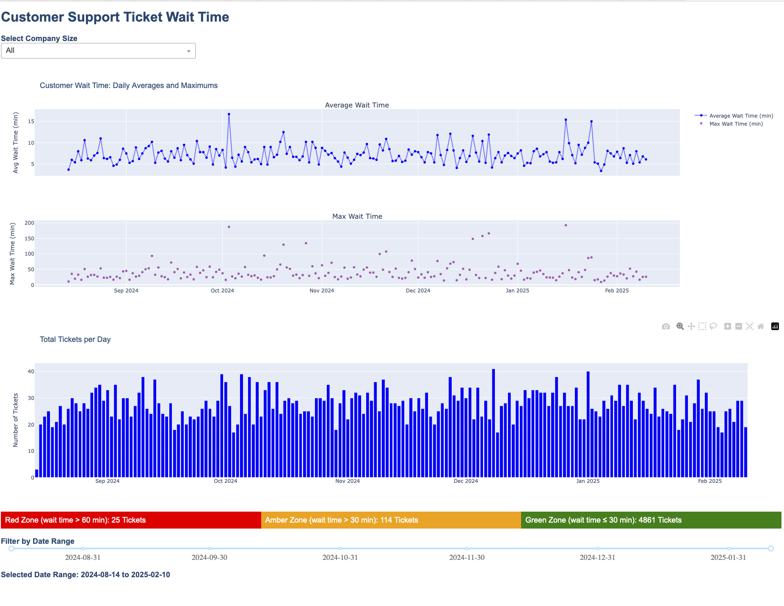

# Neon Support Queue Dashboard

A lightweight dashboard to visualize customer support wait times and monitor Neon PostgreSQL usage in real time.

## Overview

This tool helps B2B SaaS teams explore how long customers are waiting for support, identify bottlenecks in response times, and trigger alerts when usage exceeds predefined thresholds.

It supports filtering by company size and includes alerting logic for wait time zones (green/amber/red).

## Dashboard Preview



## ERD (Entity Relationship Diagram)


## Features

- Interactive dashboard built with Dash + Plotly
- Filter by company size and date range
- Email alerts when DB usage exceeds thresholds
- Clear visual distinction between long wait time zones
- Modular project structure with data ingestion + monitoring scripts

## Project Structure

```text
neon_support_queue/
├── app/                    # Dash app layout + callbacks
│   └── app.py
├── db/                     # Data ingestion, DB connection, and processing
│   ├── create_tables.sql
│   ├── data_generator.py
│   ├── neon_data_processing.py
│   ├── neon_post_data.py
│   ├── neon_post_data_test.py
│   └── neon_test_connection.py
├── monitor/                # Monitoring utilities (log rotation, usage checks)
│   ├── log_config.py
│   ├── neon_kill_switch.py
│   ├── neon_monitor.py
│   └── test_log_rotation.py
├── utils/                  # Email and env utilities
│   ├── neon_utils.py
│   ├── neon_utils.log
│   └── test_read_env.py
├── assets/                 # Dashboard visuals
│   └── customer_wait_times_dashboard.png
├── diagrams/               # ERD and additional diagrams
│   └── schema_erd.png
├── data_files/             # Sample input dataset
│   └── support_queue.csv
├── logs/                   # App/runtime logs
│   └── usage_warnings.log
```

## Setup

1. **Clone the repo** and navigate into it:

   ```bash
   git clone https://github.com/your-username/neon_support_queue.git
   cd neon_support_queue

2.	**Install Poetry** (if not already installed):   
curl -sSL https://install.python-poetry.org | python3 -

3.	**Install dependencies**:

poetry install

4.	**Create a .env file** with the following:
NEON_DB_URL=your_neon_database_url
SENDGRID_API_KEY=your_sendgrid_api_key
FROM_EMAIL=alerts@yourdomain.com
ALERT_EMAIL=your_email@yourdomain.com

5.	**Run the app**:
poetry run python neon_support_queue/app/app.py

## Dependencies

- Python 3.11+
- Dash / Plotly
- pandas, SQLAlchemy
- psycopg2-binary, python-dotenv
- schedule, tenacity, retrying
- SendGrid (for email alerts)

All managed via poetry and specified in `pyproject.toml`.

## License

This project is licensed under the terms of the MIT License.  
See the [LICENSE](LICENSE) file for details.