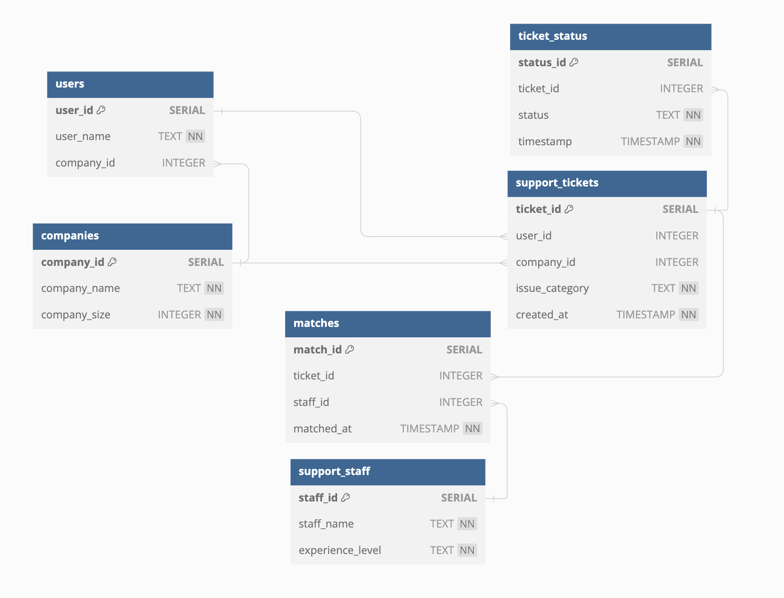

# Neon Support Queue Dashboard

A lightweight yet powerful dashboard to visualise customer support wait times, ticket volume trends, and monitor Neon PostgreSQL usage. Built with Python, Plotly Dash, and deployed via Render.

## Overview

This dashboard visualizes synthetic support ticket data to explore customer wait times and Neon database usage.  
It helps simulate what support teams might face in a real-world B2B SaaS environment.

Built with Plotly Dash, the app supports filtering by company size, date range, and includes threshold alerts based on database usage. It also visualises total ticket counts per day to help spot high-demand periods.

It is intended as a prototype for exploring operational bottlenecks and visual monitoring approaches.

**Note:** This version uses synthetic data. For real-time deployment, data ingestion from a live support system (e.g. Zendesk, Intercom) can be added, with periodic refreshing.

## Dashboard Preview


## Live Demo

Test the app live in your browser: 
[View on Render](https://neon-support-dashboard.onrender.com)

## ERD (Entity Relationship Diagram)



## Features

- Interactive dashboard (Dash + Plotly)
- Color-coded zones for visual monitoring of wait time thresholds
- Filter by company size and date
- Visualises daily support ticket volume to identify usage spikes
- Background monitoring for Neon DB usage
- Email alerts triggered when Neon DB usage exceeds thresholds (via SendGrid)
- Modular project structure with data ingestion, monitoring, and logging scripts

## Project Structure

```text
neon_support_queue/
├── app/                    # Dash app layout + callbacks
│   └── app.py
├── db/                     # Data ingestion, DB connection, and processing
│   ├── create_tables.sql
│   ├── data_generator.py
│   ├── neon_data_processing.py
│   ├── neon_post_data.py
│   ├── neon_post_data_test.py
│   └── neon_test_connection.py
├── monitor/                # Monitoring utilities (log rotation, usage checks)
│   ├── log_config.py
│   ├── neon_kill_switch.py
│   ├── neon_monitor.py
│   └── test_log_rotation.py
├── utils/                  # Email and env utilities
│   ├── neon_utils.py
│   ├── neon_utils.log
│   └── test_read_env.py
├── assets/                 # Dashboard visuals
│   └── customer_wait_times_dashboard.png
├── diagrams/               # ERD and additional diagrams
│   └── schema_erd.png
├── data_files/             # Sample input dataset
│   └── support_queue.csv
├── logs/                   # App/runtime logs
│   └── usage_warnings.log
```

## Tech Stack

- Python 3.11+
- Dash / Plotly
- Pandas, SQLAlchemy
- Gunicorn (for production)
- Neon (PostgreSQL)
- SendGrid (email alerts)
- dotenv (environment config)

## Local Development Setup

1. **Clone the repo** and move into it:

```bash
git clone https://github.com/your-username/neon_support_queue.git
cd neon_support_queue
```

2. **Install Poetry** (if needed):

```bash
curl -sSL https://install.python-poetry.org | python3 -
```

3. **Install dependencies**:

```bash
poetry install
```

4. **Create a `.env` file** in root with:

```env
USE_NEON=1
NEON_DB_URL=your_neon_database_url
NEON_API_KEY=your_api_key
NEON_PROJECT_ID=your_project_id
EMAIL_SENDER=your_email@gmail.com
EMAIL_PASSWORD=your_password_or_app_key
EMAIL_RECEIVER=your_email@gmail.com
SUPABASE_URL=your_supabase_url
SUPABASE_KEY=your_supabase_key
```

5. **Run the app locally**:

```bash
poetry run python neon_support_queue/app/app.py
```

## Deployment (Render)

The Dash app is served using Gunicorn, a production-grade WSGI server.
1.Push your repo to GitHub
2.Connect it on [Render.com](https://render.com/)
3.Use gunicorn neon_support_queue.app.app:server as the Start Command
4.Add your .env as a Secret File
5.Set Health Check Path to /healthz
6.Done!


## API Endpoint

The dashboard includes a simple public API for external integrations or custom visualisations.

- **URL (local)**:  
  `http://localhost:10000/api/avg-wait-times`

- **Returns**:  
  JSON array of daily average wait times (based on processed ticket data)

- **Example**:

```json
[
  { "created_at": "2024-08-20", "wait_time_minutes": 12.5 },
  { "created_at": "2024-08-21", "wait_time_minutes": 8.4 }
]

## Optional Monitoring

Integrate [UptimeRobot](https://uptimerobot.com/) with `/healthz` to prevent cold starts and ensure uptime.

## License

This project is licensed under the MIT License.  
See the [LICENSE](LICENSE) file for details.